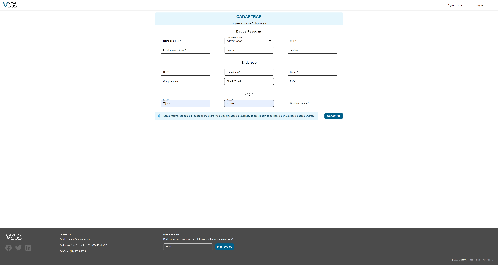
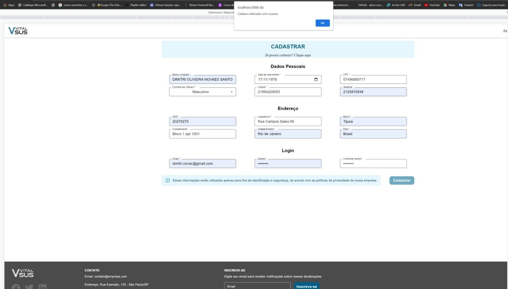
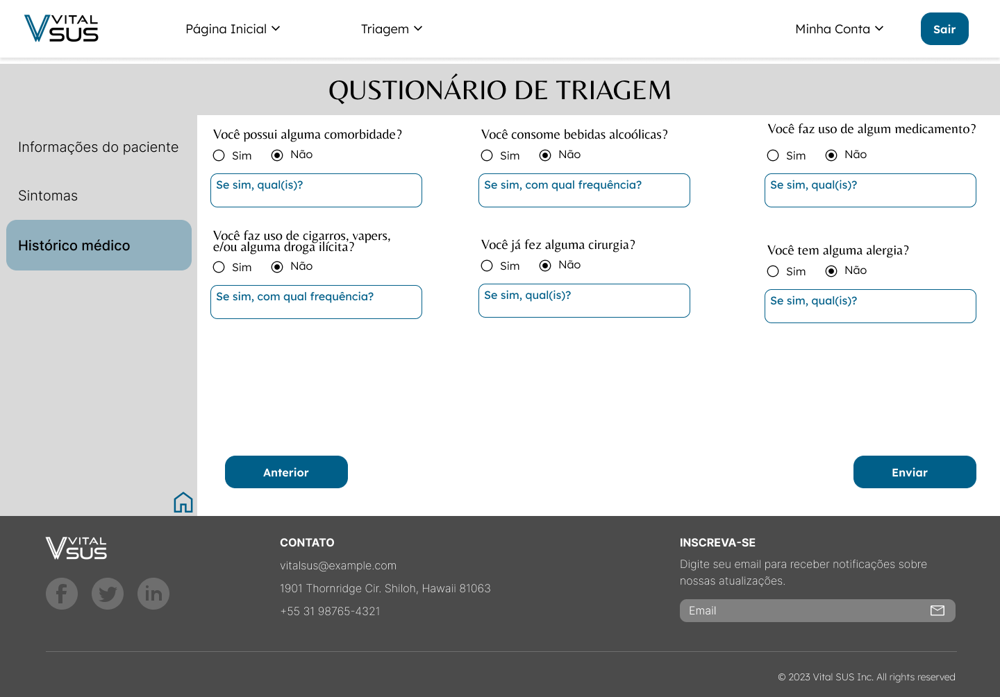

# Plano de Testes de Software

Os planos de testes com casos de teste são documentos cruciais para garantir a qualidade do software. Eles descrevem a estratégia de teste, cronograma e recursos necessários, além de especificar os casos de teste a serem executados. Os casos de teste são cenários detalhados que definem os passos, entradas, ações e resultados esperados de cada teste. Com esses planos, é possível testar o software de forma organizada, identificar defeitos e garantir que o sistema atenda aos requisitos estabelecidos e às expectativas dos usuários.

Esses planos também são responsáveis por orientar a equipe de teste e fornecer uma estrutura para relatar e acompanhar os resultados dos testes. Eles abrangem diferentes tipos de testes, como testes de unidade, integração, sistema, desempenho e segurança. Ao seguir esses planos, é possível garantir uma abordagem estruturada e eficiente para o teste de software, assegurando a robustez do sistema e sua conformidade com os requisitos funcionais e não funcionais.

<table>
  <tr>
    <td><b>Caso de teste</b></td>
    <td> <b>CT-01</b> Vizuaizar página inicial</td>
  </tr>
  <tr>
    <td><b>Requisitos associados</b></td>
    <td>
        <b>RF-001</b>	O site deve apresentar uma página inicial visualize informaçoes sobre a triagem. 
        <b>RNF-002</b>	O site deverá ser responsivo permitindo a visualização em um celular de forma adequada.	
    </td>
  </tr>
  <tr>
    <td><b>Objetivo do teste</b></td>
    <td> Verificar de a página inicial exibe corretamente</td>
  </tr>
  <tr>
    <td><b>Passos</b></td>
    <td>
        <li> Inicie o programa com <i>npm start</i></li>
        <li> Visualizar a página inicial</li>
    </td>
  </tr>
  <tr>
    <td><b>Critérios de êxito</b></td>
    <td>
        <li>Deve ser exibido a página inicial com duas sessões: "Se sentindo mal?" e "Benefícios de uma triagem online"</li>
        <li>Deve estar responsivo para desktop, tablet e mobile a página o header e o footer.</li>
    </td>
  </tr>
</table>

#### Evidência:

---

<table>
  <tr>
    <td><b>Caso de teste</b></td>
    <td> <b>CT-02</b> Realizar acesso ao sistema através da tela login</td>
  </tr>
  <tr>
    <td><b>Requisitos associados</b></td>
    <td>
        <b>RF-002</b>	O site deve apresentar uma página onde o usuário faça o login.
    </td>
  </tr>
  <tr>
    <td><b>Objetivo do teste</b></td>
    <td> Verificar a autenticação do usuário cadastrado</td>
  </tr>
  <tr>
    <td><b>Passos</b></td>
    <td>
        <li> Acessar a pagina de login clicando no botão "Entrar/Criar conta"</li>
        <li> Informar email e senha já cadastrado</li>
        <li> Exemplo - <b>email:</b> "usuario1@example.com"
    <b>senha:</b> "senhaSegura123"</li>
    <li> Confirmar clicando no botão "Entrar"</li>
    </td>
  </tr>
  <tr>
    <td><b>Critérios de êxito</b></td>
    <td>
        <li>O botão só ficará habilitado caso o email e senha esteja cadastrado</li>
        <li>Ao clicar em "Entrar", deverá exibir um alert com login de sucesso e redirecionar para a página inicial</li>
    </td>
  </tr>
</table>

#### Evidência:

---

<table>
  <tr>
    <td><b>Caso de teste</b></td>
    <td> <b>CT-03</b> Redirecionar usuário não cadastrado para tela de cadastro</td>
  </tr>
  <tr>
    <td><b>Requisitos associados</b></td>
    <td>
        <b>RF-003</b> A página login deve apresentar um "link" para redirecionar o usuário para página de cadastro.
    </td>
  </tr>
  <tr>
    <td><b>Objetivo do teste</b></td>
    <td> Verificar o direcionamento do usuário não cadastrado</td>
  </tr>
  <tr>
    <td><b>Passos</b></td>
    <td>
        <li> Acessar a pagina de login</li>
        <li> Clicar no link "Clique aqui"</li>
    </td>
  </tr>
  <tr>
    <td><b>Critérios de êxito</b></td>
    <td>
        <li>O usuário deve ser redirecionado a página cadastro da aplicação</li>
    </td>
  </tr>
</table>

#### Evidência:

---

<table>
  <tr>
    <td><b>Caso de teste</b></td>
    <td> <b>CT-04</b> Cadastrar novos usuários</td>
  </tr>
  <tr>
    <td><b>Requisitos associados</b></td>
    <td>
        <b>RF-004</b> O site deve possuir funcionalidade de cadastro de novo usuários.
    </td>
  </tr>
  <tr>
    <td><b>Objetivo do teste</b></td>
    <td> Verificar o cadastro de novos usuários</td>
  </tr>
  <tr>
    <td><b>Passos</b></td>
    <td>
        <li> Acessar a pagina de cadastro clicando no link "Clique aqui" na página de cadastro</li>
        <li> Preencher todos os campos obrigatórios</li>
        <li> Confirmar clicando no botão "Cadastrar"</li>
    </td>
  </tr>
  <tr>
    <td><b>Critérios de êxito</b></td>
    <td>
        <li>Ao clicar em "Cadastrar", deverá exibir um alerta com cadastro de sucesso e redirecionar para a página inicial.</li>
        <li>Fazer download de um arquivo json com todas as informações de cadastros.</li>
    </td>
  </tr>
</table>

#### Evidência:

---

---<table>

  <tr>
    <td><b>Caso de teste</b></td>
    <td> <b>CT-05</b> Questionário de triagem</td>
  </tr>
  <tr>
    <td><b>Requisitos associados</b></td>
    <td>
        <b>RF-005</b> O site deve possuir a funcionalidade de cadastro dos sintomas dos usuários.
    </td>
  </tr>
  <tr>
    <td><b>Objetivo do teste</b></td>
    <td> Verificar o cadastro dos sintomas dos usuários</td>
  </tr>
  <tr>
    <td><b>Passos</b></td>
    <td>
        <li> Com o usuário logado</li>
        <li> Acessar a página do questionário de triagem clicando no botão "iniciar triagem" na página inicial</li>
        <li> Acessar a aba "informações do paciente" na página de questionário de triagem </li>
        <li> Preencher todos os campos obrigatórios</li>
        <li> Confirmar clicando no botão "próximo"</li>
    </td>

  </tr>
  <tr>
    <td><b>Critérios de êxito</b></td>
    <td>
        <li>Ao clicar em "próximo", não deverá exibir um alerta se os campos obrigatórios forem preenchidos corretamente</li>
        <li>Fazer download de um arquivo json com todas as informações da aba "informaçãoes do paciente".</li>
    </td>
  </tr>
</table>

#### Evidência:

---

---<table>

  <tr>
    <td><b>Caso de teste</b></td>
    <td> <b>CT-06</b> Questionário de triagem</td>
  </tr>
  <tr>
    <td><b>Requisitos associados</b></td>
    <td>
        <b>RF-006</b> O site deve possuir a funcionalidade de cadastro dos sintomas dos usuários.
    </td>
  </tr>
  <tr>
    <td><b>Objetivo do teste</b></td>
    <td> Verificar o cadastro dos sintomas dos usuários</td>
  </tr>
  <tr>
    <td><b>Passos</b></td>
    <td>
        <li> Com o usuário logado</li>
        <li> Após ter clicado no botão próximo na aba de "informaçoõs do paciente" </li>
        <li> Acessar a aba "sintomas" na página de questionário de triagem </li>
        <li> Preencher todos os campos obrigatórios</li>
        <li> Confirmar clicando no botão "proximo"</li>
      </td>

  </tr>
  <tr>
    <td><b>Critérios de êxito</b></td>
    <td>
        <li>Ao clicar em "próximo", irá para aba seguinte.</li>
        <li> Ao clicar em "anterior" retornará aba de "informações do paciente" e se perderá as informações preenchidas mas que não foram salvas.</li> 
        <li>Fazer download de um arquivo json com todas as informações da aba "sintomas".</li>
    </td>
  </tr>
</table>

#### Evidência:

---

---<table>

  <tr>
    <td><b>Caso de teste</b></td>
    <td> <b>CT-07</b> Questionário de triagem</td>
  </tr>
  <tr>
    <td><b>Requisitos associados</b></td>
    <td>
        <b>RF-007</b> O site deve possuir a funcionalidade de cadastro dos sintomas dos usuários.
    </td>
  </tr>
  <tr>
    <td><b>Objetivo do teste</b></td>
    <td> Verificar o cadastro dos sintomas dos usuários</td>
  </tr>
  <tr>
    <td><b>Passos</b></td>
    <td>
        <li> Com o usuário logado</li>
        <li> Após ter clicado no botão "próximo" na aba de "sintomas"</li>
        <li> Acessar a aba "histórico médico" na página de questionário de triagem </li>
        <li> Preencher todos os campos obrigatórios</li>
        <li> Confirmar clicando no botão "enviar"</li>
    </td>

  </tr>
  <tr>
    <td><b>Critérios de êxito</b></td>
    <td>
        <li> Ao clicar em "enviar", deverá exibir um alerta se os campos obrigatórios forem preenchidos corretamente.</li>
        <li> Ao clicar em "anterior" retornará para a aba de "sintomas" e se perderá as informações preenchidas mas que não foram salvas. </li> 
        <li> Fazer download de um arquivo json com todas as informações da aba "histórico médico".</li>
    </td>
  </tr>
</table>

#### Evidência:

---
